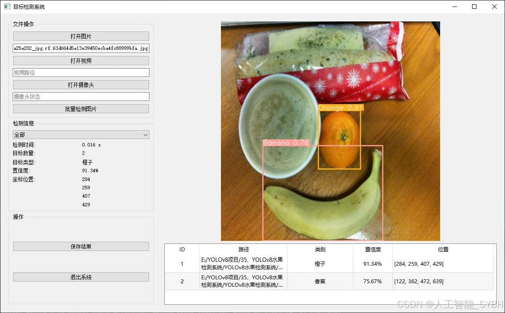
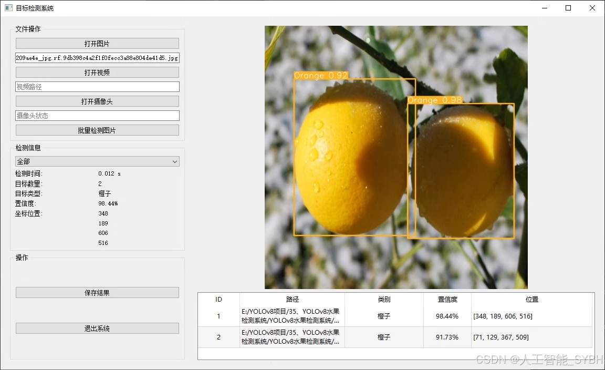
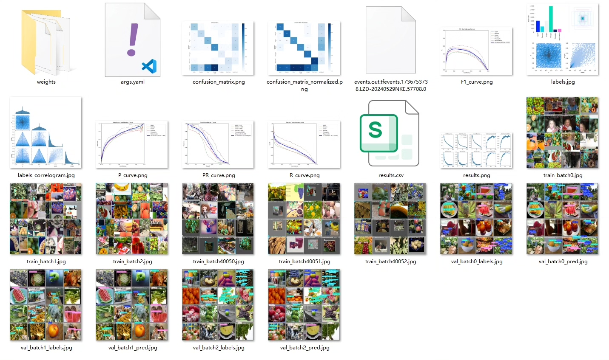
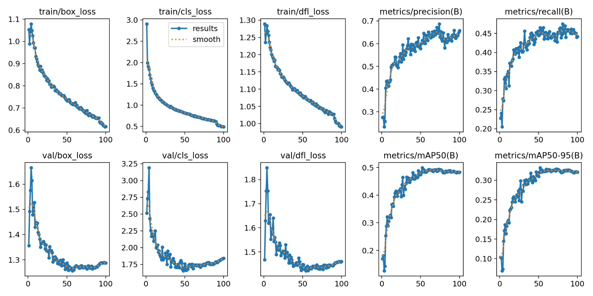
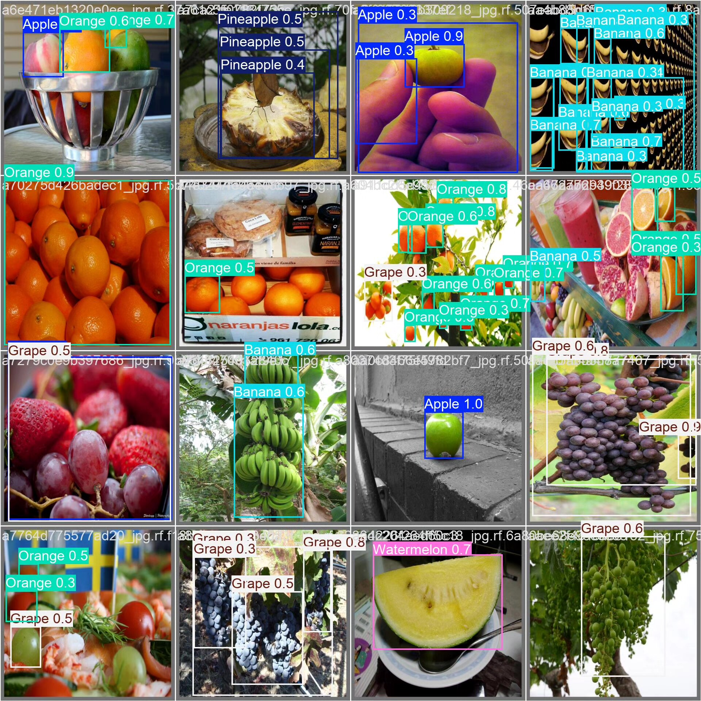
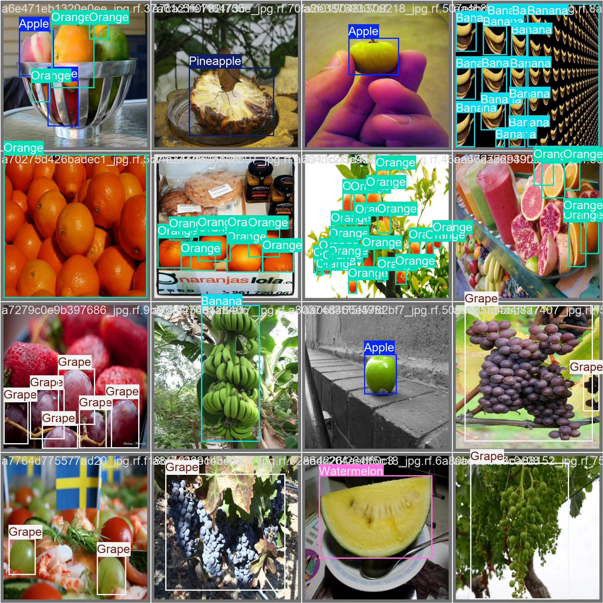
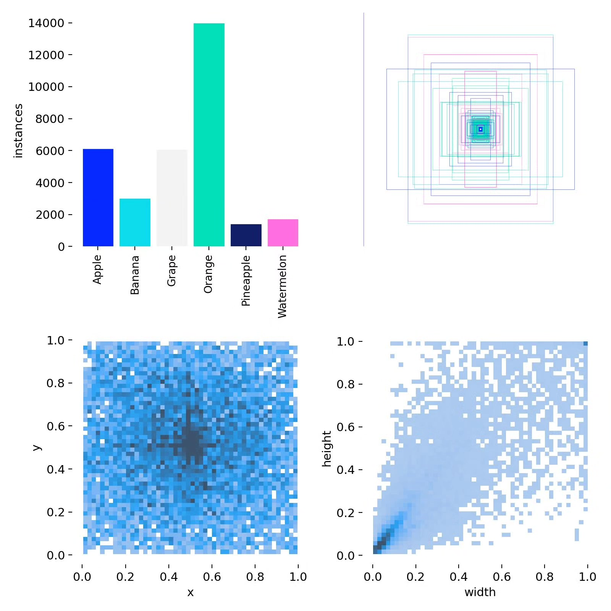
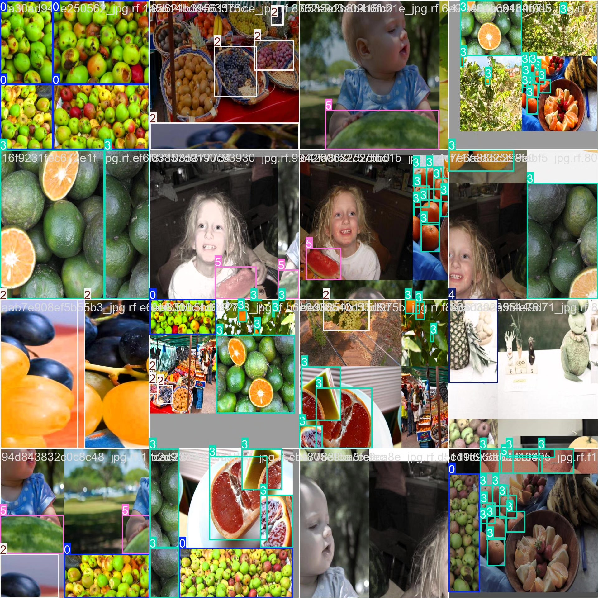

# Fruit detection system based on YOLOv8 deep learning (YOLOv8+YOL)

## Body

This project is based on the YOLOv8 (You Only Look Once version 8) deep learning target detection algorithm, developing a high-efficiency and precise automatic fruit detection and recognition system. The system can intelligently identify six common fruits: Apple (Apple), Banana (Banana), Grape (Grape), Orange (Orange), Pineapple (Pineapple), and Watermelon (Watermelon). Through large-scale dataset training optimization, with a training set of 7,108 images, a validation set of 914 images, and a test set of 457 images, ensuring that the model has excellent generalization ability and robustness.

The company's products have obtained the official commercial license certification from YOLO.

We provide after-sales service.

After payment, we will provide WeChat ID for any questions.

Environment configuration: We will provide an environment configuration tutorial, and WeChat will provide answers to questions.

Remote installation service: If you need remote configuration, an additional fee of 69 is required,
if the configuration fails, all fees will be refunded (specially for old computers only refund installation fees)

Retraining dataset: After setting up the environment, you can train on your own computer.
If you need us to retrain, just pay 69 + computing power fees (2.5 yuan/hour)

Full after-sales service

## Images

## Payment

Here is a pay link on Stripe ( https://buy.stripe.com/3cs8yP7sY87d0vu9AB ). Please contact me lonlonago@foxmail.com after funding $89, and I will send you a complete data files , thank you!

